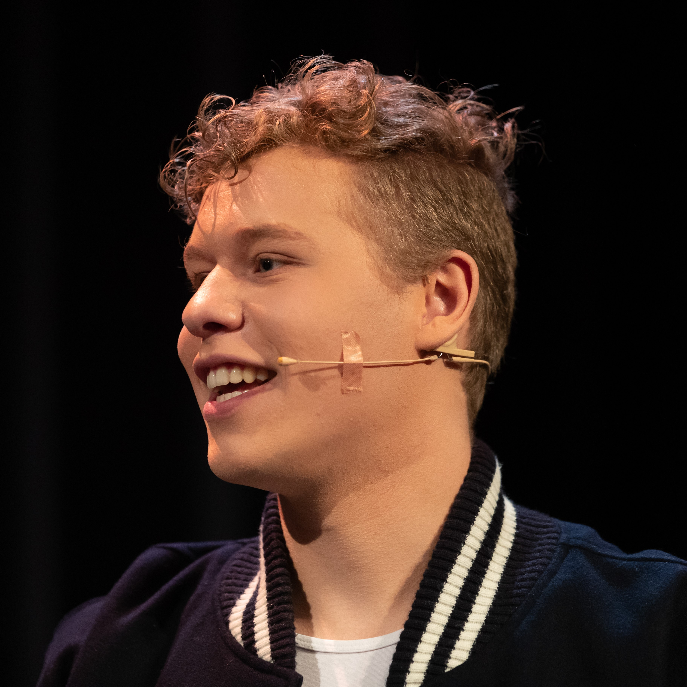

<!DOCTYPE html>
<html>
<article class="GraphicDesign">
    
<head>
    <meta charset="UTF-8">
    <meta http-equiv="X-UA-Compatible" content="IE=edge">
    <meta name="viewport" content="width=device-width, initial-scale=1.0">
    <link rel="stylesheet" href="css/style.css" />
    <link rel="shortcut icon" href="favicon.ico">
    <link rel="apple-touch-icon" sizes="57x57" href="images/favicon/L logo 57x57.png">
    <link rel="apple-touch-icon" sizes="72x72" href="images/favicon/L logo 72x72.png">
    <link rel="apple-touch-icon" sizes="114x114" href="images/favicon/L logo 114x114.png">
    <link rel="apple-touch-icon" sizes="144x144" href="images/favicon/L logo 144x144.png">
    <title>Lucas' Portfolio Website</title>
</head>

<body>

    <header>
        <a href="#"><figure></figure></a>
        
            
                
            <nav>
                <ul class="navsmall">
                    <li><a href="index.html">About me</a></li>
                    <li><a href="Games.html">Games</a></li>
                    <li class="active"><a href="Design.html">Design</a></li>
                    <li><a href="TheaterandMusic.html">Theater and Music</a></li>
                    <li><a href="EducationandCourses.html">Education and Courses</a></li>
                    <li><a href="Volunteerwork.html">Volunteer work</a></li>
                    <li><a href="Career.html">Career</a></li>
                    <li><a href="Skills.html">Skills</a></li>
                    <li><a href="Contact.html">Contact</a></li>
                </ul>
            </nav>

    <section>
    <nav>
        <ul class="navsmall">
            <li><a href="Design.html">About design</a></li>
            <li><a href="GraphicDesign.html">Graphic Design</a></li>
            <li class="active"><a href="UIUXDesign.html">UI/UX Design</a></li>
            <li><a href="WebDesign.html">Web Design</a></li>
            <li><a href="3DModels.html">3D Models</a></li>
        </ul>
    </nav>
</section>

    </header>

    <section class="chonk">
        <main>
            <aside class="bigheader">
                <section class="formContainer">
                    <article class="border">
                        <h2>Go to:</h2>
                        <ul>
                        <li><a href="#"><b>Gamification of the Online Library app</b></a></li>
                        <h2 class="indent"><li><a href="#AboutLibrary"><b>About</b></a></li></h2>
                        <h2 class="indent"><li><a href="#PrototypeLibrary"><b>Prototype</b></a></li></h2>
                        <h2 class="indent"><li><a href="#JustificationLibrary"><b>Justification</b></a></li></h2>
                        <h2 class="indent"><li><a href="#ReflectionLibrary"><b>Reflection</b></a></li></h2>
                        <li><a href="#LofiBlackboard"><b>Low fidelity Blackboard prototype</b></a></li>
                        <h2 class="indent"><li><a href="#AboutBlackboard"><b>About</b></a></li></h2>
                        <h2 class="indent"><li><a href="#PrototypeBlackboard"><b>Prototype</b></a></li></h2>
                        <h2 class="indent"><li><a href="#JustificationBlackboard"><b>Justification</b></a></li></h2>
                        <h2 class="indent"><li><a href="#ReflectionBlackboard"><b>Reflection</b></a></li></h2>
                        <li><a href="#LofiFPS"><b>Low fidelity first-person shooter prototype</b></a></li>
                        <h2 class="indent"><li><a href="#AboutFPS"><b>About</b></a></li></h2>
                        <h2 class="indent"><li><a href="#PrototypeFPS"><b>Prototype</b></a></li></h2>
                        <h2 class="indent"><li><a href="#JustificationFPS"><b>Justification</b></a></li></h2>
                        <h2 class="indent"><li><a href="#ReflectionFPS"><b>Reflection</b></a></li></h2>
                        </ul>
                    </article>
                </section>
            </aside>
        
        <section>
            <article>
                <h1>Gamification of the Online Library app</h1>
                <time>March, 2025 - May, 2025</time>
                <h2 id="AboutLibrary">About:</h2>
                

                    After empathizing with the target audience, I came to the following conclusion: the online library app is currently not very attractive. 
                    It is very simple and intuitive to use, but not fun to use or read books, which is, of course, the goal. 
                    The target users are youth between 12 and 18 years old. 
                    Only half of the youth read a book in their spare time, only once a week! 
                    I want them to train their skills by reading and listening more to books, to expand their knowledge of vocabulary, language, and grammar. 
                    Therefore, I will reconstruct the online library app to make it more attractive, interactive, and fun to use using gamification theory and elements; specifically, Structural Gamification. 
                    The revision is targeted at youth, but it should still be simple and attractive enough for kids and adults to use it too.” 
                 
                 
                <h2>Programs:</h2>
                    Made in Figma
                 
                 
                <h2 id="PrototypeLibrary">Prototype:</h2>
                    <iframe style="border: 1px solid rgba(0, 0, 0, 0.1);" width="800" height="450" src="https://embed.figma.com/proto/xx7d7BadHYjh8fw0BRnlwf/Gamification?node-id=69-21&embed-host=share" allowfullscreen></iframe>
                 
                 
                <h2 id="JustificationLibrary">Justification:</h2>
                    The user has Autonomy over what books they choose to read and their profile by customizing their profile picture. 
                    Progress bars for the chapters and audiobooks are implemented so the user knows when the goal is hit, which fuels intrinsic motivation. 
                    The leaderboard is used for Social Connection and will enhance the user's intrinsic  motivation through social reinforcement. 
                    The competition also functions as an extrinsic motivator. 
                    XP and badges can be obtained, functioning as extrinsic motivators. 
                    A level system functioning as a gamified rewards program unlocks new profile pictures as an achievement to give the user motivation to obtain XP. 
                    Badges can be obtained by participating in time-limited challenge events. 
                 
                    <ul>
                        <li>Epic Meaning is achieved by telling the user that 646K players got this badge already before them, so the user wants to be part of that group.</li>
                        <li>Accomplishment is achieved through XP as Status Points, Badges, Fixed Action or Earned Lunch through challenges, the Leaderboard, and Progress Bars.</li>
                        <li>Empowerment of Creativity is achieved by having the user express themself creatively when writing a review and giving Feedback. 
                            The user can also express themself by customizing their profile picture.</li>
                        <li>Ownership is mainly achieved through Collection Sets: the challenge Badges are a series. 
                            The user can also customize their profile picture to feel closer to their digital persona.</li>
                    </ul>
                    These White Hat Core Drives do not create any sense of urgency. 
                 
                    <ul>
                        <li>Social Influence is achieved by Friending other users and the badges that function as a Trophy Shelf.</li>
                        <li>Scarcity is achieved by Prize Pacing because the badges are sets. 
                            A Count Down Timer is also displayed for the badges to display how long the user has to complete the challenge and obtain the badge. 
                            A Last Mile Drive is displayed after obtaining XP; a message is shown on how much more XP is needed to beat a friend.</li>
                        <li>Unpredictability is achieved by having Sudden Rewards; the user wrote their first review and earned a secret Profile Picture.</li>
                        <li>Avoidance is achieved by having a Sunk Cost Prison; if the user does not log in daily, the XP streak will stop exponentially adding up, and the user has to start with a small XP boost again on day 1. 
                            It is also a form of Streaking. 
                            The challenges that are only for a couple of days to obtain an exclusive badge are a form of an Evanescence Opportunity and could be seen as a FOMO Punch for not getting the badge in time. </li>
                    </ul>
                    These Black Hat Core Drives create a sense of urgency. 
                 
                    I created messages for limited-time events and daily logins, functioning as triggers that get the user in the Engagement Loop. 
                    After the task or Action is completed, an amount of XP, badge, or profile picture is gained as a Variable Reward. 
                    Setting a new profile picture could be seen as an Investment. 
                    After the Investment or Variable Reward, a message is shown with how much XP is needed to beat a friend, which functions as a Trigger for a ‘new’ Engagement Loop. 
                 
                 
                    Many of these theories and gamification elements have been implemented in apps like Duolingo, Coffee Break, and YouVersion. 
                 
                 
                    As a result of user testing, I added XP to battle your friends, a page to add friends, a daily login system, messages for limited-time events, a level system, and rounded some corners. 
                    I also added Epic Meaning and Unpredictability to represent every Octalysis Core Drive. 
                    
                 
                 
                <h2 id="ReflectionLibrary">Reflection:</h2>
                    The online library app is now more attractive and fun to use, because Structural Gamification theory is applied. 
                    The little goals and rewards in between sessions will make it easier for the user to stay focused and get motivated to read more. 
                    “On brand” UI images and icons are created and used to not break the immersion for the user. 
                    Daily login reminders will trigger the user to read more often. 
                    This way, the user will expand their vocabulary and knowledge of language and grammar. 
                    Both young and old can use the app because it is simple and accessible. 
                 
                 
                    During this project, I learned a lot about <b>Gamification</b>, <b>UI / UX Design</b>, <b>Prototyping</b>, <b>Figma</b>, and <b>Design Thinking</b>.
                

            </article>

            <article>
                <h1 id="LofiBlackboard">Low fidelity Blackboard prototype</h1>
                <time>March, 2024 - May, 2024</time>
                <h2 id="AboutBlackboard">About:</h2>
                

                    For this assignment, I have adjusted the User Interface (UI) and User Experience (UX) of the <a href="http://leren.saxion.nl/" target="_blank">Blackboard</a> website.
                 
                 
                    The current Home page is unclear and overstimulating. 
                    A revision is needed with layered menus to choose from, different text sizes, and colors to emphasize what topics are related and create a better overview. 
                    It needs to be clear and not crowded, so it is not overstimulating. 
                    A clear contrast is going to be used between interactive elements and the background using colors. 
                    Appropriate sounds are needed as a way of feedback. 
                    When a button is highlighted, a different color is needed to make it clearer what button will be pressed. 
                    Icons/logos will be implemented to make the interface easier to understand. 
                    Interactive items will be used only once and not many times all over the place, so the interface will not be unclear.
                 
                 
                    In the current Course page, layered menus will be implemented for the year, schoolyear, and term. 
                    A button will be added for easy enrolment. 
                    The top part will stay consistent with the main menu to contain consistency. 
                    Different text sizes and colors will be used to emphasize what topics are related and create a better overview. 
                    A clear contrast is going to be used between interactive elements and the background using colors. 
                    Appropriate sounds are needed as a way of feedback. 
                    When a button is highlighted, a different color is needed to make it clearer what button will be pressed. 
                    Icons/logos will be implemented to make the interface easier to understand. 
                    Interactive items will be used only once and not many times all over the place, so the interface will not be unclear.
                 
                 
                <h2>Programs:</h2>
                    Made in Figma
                 
                 
                <h2 id="PrototypeBlackboard">Prototype:</h2>
                <iframe style="border: 1px solid rgba(0, 0, 0, 0.1);" width="800" height="450" src="https://embed.figma.com/proto/etBxnsDhXkhkYDpRAxIiWs/UI-UX-Website-Prototype?node-id=50-6&p=f&scaling=contain&content-scaling=fixed&page-id=0%3A1&embed-host=share" allowfullscreen></iframe>
                    In this Blackboard website prototype, the mouse can be used to see the schedule for the coming days and to switch to the Courses and Home page.
                 
                 
                <h2 id="JustificationBlackboard">Justification:</h2>
                    In the top left some layered menus are added for the user, the study (CMGT), and the extras. 
                    The extras contain the parts of the website the user will use very rarely, like the Master. 
                    The Announcements, Courses, Marks, Calendar, and Library have a bigger button in a wide row because these are important parts that are used frequently. 
                    The icons explain the terms better and make it easier and faster for the user to see where he wants to go. 
                    The messages are sorted into courses and ‘other’, to make it easy to see and overview the messages. 
                    The order of these courses will stay consistent on other interfaces. 
                    A couple of messages can be displayed at a time, making it easy to see what message is important for the user. 
                    The number of messages and their importance are displayed using the colored icons as well as the title of the messages. 
                    The deadlines are also displayed on the homepage so the user will not have to search far for this important information. 
                    Multiple deadlines can be displayed per course. Lastly, the schedule is displayed on the right side. 
                    The cyan column indicates that this is the current lesson. 
                    The red text indicates a change in the schedule and the blue link is an online class. 
                    The course, time, and place are all displayed in a convenient column. 
                    Buttons are added to be able to view the next and previous days.
                 
                 
                    In the top left some layered menus are added for the user, the study (CMGT), and the extras. 
                    The extras contain the parts of the website the user will use very rarely, like the Master. 
                    The Announcements, Courses, Marks, Calendar, and Library have a bigger button in a wide row because these are important parts that are used frequently. 
                    The icons explain the terms better and make it easier and faster for the user to see where he wants to go. 
                    The courses are easy to see and overview. 
                    The order of these courses will stay consistent on other interfaces. 
                    At the top, there are layered menus for the year, schoolyear, role, and term. 
                    The system will remember these for you. 
                    In the middle an information section is added with all important information about the course; like announcements, deadlines, assessments, and resources. 
                    This is a faster option to get to the important resources. 
                    The option to show all is also given. 
                    An extra button is added for the current online lesson. 
                    The color is purple/dark blue because this is the color Teams uses. 
                    This gives the user a sense of familiarity and an immediate understanding of what the button is for without reading the text first. 
                    A connection icon is also implemented to enhance this familiarity even more. 
                    Also, a button to the side is added for easy enrollment to all courses.
                 
                 
                    I chose to use a grid, to have an easy overview of the screens. 
                    All elements are evenly spaced and most of the screen is utilized. 
                    The borders of the screen are mostly empty, to not make it feel too cluttered. 
                    This design makes a clean and organized design. 
                    On the courses page, more important elements are made bigger, while less important elements are made a bit smaller. 
                    This way the important information is transferred to the user quickly. 
                    Although both grids are not completely the same, they are both optimized for the corresponding content.
                 
                 
                    I wanted to create a clear and intuitive website, with all important information displayed, without feeling too cluttered. 
                    Non-important information is tucked away into menus and expanding buttons like “extras” and “show all”. 
                    Related elements are close or next to each other, so the website stays intuitive. 
                    The Announcements, Courses, Marks, Calendar, and Library have a bigger button in a wide row because these are important parts that are used frequently. 
                    The messages are sorted on courses and other, to make it easy to see and overview the messages. 
                    The order of these courses will stay consistent on other interfaces. 
                    A couple of messages can be displayed at a time, making it easy to see what message is important for the user. 
                    The size of elements and fonts are used to emphasize the importance of the elements. 
                    This way the elements stay in the grid and are clear. 
                    The most important information that the user uses on a day-to-day basis is on the home page, while the specific information about courses is on the courses page. 
                    This way the UI stays clean and the user knows where to find certain information. 
                    The spacing enhances the clarity and structure of the website.
                 
                 
                    I have used colors in various ways in my design. 
                    I made the signing-off icon red because this is a widely used color for this. 
                    The same goes for the blue links and the green checkmarks. 
                    The red exclamation mark is used to seem even more important than the black exclamation mark. 
                    In the roster on the right, the blue background color means that this is the current lesson. 
                    The red text is a change: the lesson is in another room than normally. 
                    The online button is blue and underlined to show it is a clickable link: the user can go from the home page directly to their current online lesson. 
                    In the ‘courses’ menus, the online lesson button is purple: specifically, the color MS Teams uses. 
                    This immediately indicates to the user this is about the online lesson/Teams, without even having read it. 
                    I made sure all added colors had a function. This made the UI more intuitive and a bit more colorful. 
                    I used a grey background for currently active buttons like ‘home’, ‘courses’, and the ‘professional orientation’ course. 
                    Using all this, I created a user-friendly and intuitive design.
                 
                 
                    I used as few different fonts as possible. 
                    This makes the whole UI feel connected. 
                    The fonts that I used are clear and easy to read, to make sure they are not distracting from the main information of the website. 
                    I tried to use fonts that feel complementary rather than unrelated. This way the UI feels more coherent. 
                    I made the text for important elements bigger and less important elements smaller. 
                    This way the UI is more intuitive to use. 
                    I made sure the text would not be too small because I wanted all the text to be easily readable. 
                    Enough spacing is added to enhance this readability. 
                    Using all this I managed to create a visually appealing and clear design that supports the website.
                 
                 
                    I chose to use simple and clear buttons. 
                    These will carry across the important information to the users, while not distracting too much. 
                    This way the user can easily use the interface fast, without having to search for something. 
                    On the home page, I chose to use a grid, rather than a table, so the UI stays clean. 
                    On the courses page, I did use a table, for the column of clickable courses. 
                    The clear text and icons on the buttons also help to traverse the message of what is ‘beneath’ the button. 
                    This way, these elements enhance the use of the buttons. 
                    I wanted all icons to be simple and clear, so it would add to the user experience. 
                    All symbols are easily visible and I tried to let them speak for themselves, so the user knows what the button does/means even without reading the text. 
                    The down arrow icons are special buttons that indicate a layered menu will pop up and the user will be able to select an option from a selection of choices. 
                    These clear icons make the website easier to use and that way more fun. 
                    I wanted the text on the buttons to be clear as well, so the user will immediately know what will happen when he clicks it. 
                    The buttons have a consistent style and color scheme, giving the website more personality. 
                    All elements combined create a cohesive look and feel.
                 
                 
                <h2 id="ReflectionBlackboard">Reflection:</h2>
                    During this project, I learned a lot about <b>Graphic Design</b>, <b>Web Design</b>, <b>UI / UX Design</b>, <b>Prototyping</b>, and <b>Figma</b>.
                

            </article>

            <article>
                <h1 id="LofiFPS">Low fidelity first-person shooter prototype</h1>
                <time>March, 2024 - May, 2024</time>
                <h2 id="AboutFPS">About:</h2>
                

                    For this assignment, I have adjusted the User Interface (UI) and User Experience (UX) of a first-person shooter game.  
                 
                 
                    I want a HUD with a clear goal, so the player will always know what to do next, even if he does not know how yet. 
                    The orientation ties into this, because if the player knows what to do, he should also be able to know where to do this/where to go next. 
                    The abilities should be clear for the player, such as special attacks for example. 
                    If these are based on time or (other) resources this should be indicated as well, so the player always knows when and what abilities can be used. 
                    I want to create a HUD with a clear composition, not taking up too much space, but not being too small. 
                    This way the player will not be distracted by the HUD while playing, but can always quickly see important information for the playing experience.  
                 
                 
                    For an FPS a ‘border-HUD’ works really well, because it shares a lot of important information and also the screen is still very visible. 
                    It is smart to have a mini-map with important orientational information, so the player knows where to go. 
                    Important items and elements should be clearly visible, so the player will always have access to important information. 
                 
                 
                    A simplistic HUD is not wrong altogether. 
                    It makes it easy to overview and all important information is close to each other. 
                    This should however not affect the HUD in a bad way, like having too little information or feeling cluttered. 
                 
                 
                <h2>Programs:</h2>
                    Made in Figma
                 
                 
                <h2 id="PrototypeFPS">Prototype:</h2>
                <iframe style="border: 1px solid rgba(0, 0, 0, 0.1);" width="800" height="450" src="https://embed.figma.com/proto/UwL91gbqgPqaTDrcDpBZZG/UI-UX-Game-Prototype?node-id=1-2&p=f&scaling=contain&content-scaling=fixed&page-id=0%3A1&embed-host=share" allowfullscreen></iframe>
                    In this first person shooter prototype, the 1 and 2 keys on your keyboard switch to weapons 1 and 2 respectively. The Tab key opens and closes the map because this is a key many games use for the map.
                 
                 
                <h2 id="JustificationFPS">Justification:</h2>
                I wanted a simple and clear design for the game where all important information can be seen easily. 
                Non-essential information is left out. 
                This way the UI is easy to use with a high visibility of the elements, as well as the game. 
                The HUD does not take up a lot of space, but it is not too small. 
                This way the player will not be distracted by the HUD while playing, but all important information for the playing experience is always in sight. 
                I chose a HUD that is ‘stuck’ to the edges of the screen because it shares a lot of information while also keeping the screen visible. 
                The contents are also mostly set in the corner, to amplify the clarity. 
                The health is represented by hearts and Flarb is the main collectible/score. 
                I revised the hearts to make them fit in with the style of the game more. 
                I made them light blue, like the ice in the game and broken hearts depict decreased health. 
                It is as if the icy heart is broken in two. 
                This gives the UI (and game) a bit more personality while fitting in with the rest and without being distracting. 
                In the top right the current mission and current task are displayed, so the player will not get lost without knowing the objective. 
                 
                 
                In the bottom right there is a minimap with an arrow for the player in red and a golden dot representing the location for the current task. 
                This way the player always knows where to go. 
                I cleared up the golden dot to be clearer and used a new red arrow, to fit the style of the game more. 
                In the bottom left is the weapon select screen. The big icon is the currently used weapon. 
                Next to it is the small icon for the secondary weapon. 
                When the player switches weapons the one icon becomes the bigger one and the other will become the smaller one. 
                On the main weapon, in the bottom left the current amount of ammo is displayed. 
                In the bottom right, the maximum amount of ammo is displayed. 
                On the other weapon, in the top left the amount of ammo is displayed, so even if the player is not using the weapon at the moment, the amount of ammo is still visible. 
                This way the options are always clear for the player. I moved the amount up on the secondary weapon, to make it more clear and visible, but kept it on the right for consistency: the amount of ammo is always on the left side. 
                On the main weapon, there are small ‘caps’ at the bottom, just above the amount of ammo and maximum amount of ammo. 
                These caps fit in with the icons, while not being distracting. 
                They help give the UI (and game) a bit more personality. 
                 
                 
                I tried to give HUD some personality while also keeping the icons clear and simple. 
                I used a grid-based layout to keep the UI clear. 
                The typography, color, and style of the UI are the same throughout the whole UI and they fit the style of the game. 
                This will improve the user's playing experience and will not distract them. 
                For switching to the first or second weapon, the 1 or 2 button is used accordingly. 
                This makes it clear and intuitive what weapon the player wants to use. 
                These buttons are used a lot for switching weapons in First Person Shooters. 
                This makes it consistent and easy to use these buttons. 
                The Tab button is used to open and close the map. 
                This makes it easy to use, because most games use the right hand to control the pointer, and the right hand to move the player; like this game. 
                The Tab button is easy to press with the right hand too. 
                This way it is easy to control the UI with one hand. 
                Switching the weapons and opening the map has nice animations. 
                This visual feedback makes clear what has happened by using the corresponding button: when Tab is pressed, the map opens and the minimap enlarges until it fills up most of the screen for example. 
                Important UI elements for using the map are still visible when the map is opened; like the current task for example. 
                This mapping is specifically chosen, because the player will probably want to see what to do, and not only where to go when the map is opened. 
                 
                 
                I have implemented the principles like recognizable icons and an intuitive layout. 
                Using these principles, I think I have created a clear, effective, and user-friendly UI with nice aesthetics and all the important information needed for a fun playing experience.
                 
                 
                <h2 id="ReflectionFPS">Reflection:</h2>
                    During this project, I learned a lot about <b>Graphic Design</b>, <b>Game Design</b>, <b>UI / UX Design</b>, <b>Prototyping</b>, and <b>Figma</b>.
                

            </article>
        </section>
</main>

<footer>
<section class="width">
    <section class="formContainer">
		<form action="https://api.web3forms.com/submit" method="POST">
            <h1>Contact me!</h1>
            <input type="hidden" name="access_key" value="5f4a45a6-2d74-4695-99b8-126965590da4">
			<input type="text" name="name" placeholder="Your name" />
			<input type="text" name="email" placeholder="Your email" />
            <input type="text" name="phone" placeholder="Your phone number (optional)" />
			<textarea name="message" placeholder="Your message"></textarea>
			<button name="submit" type="submit">Send Message</button>
		</form>
	</section>

    <nav class="footerNavigation">
        <h2>Social Media</h2>
        <ul>
            <li></li>
            <li></li>
            <li></li>
            <li></li>
        </ul>
    </nav>
</section>
</footer>

</section>

</body>
</article>
</html>
